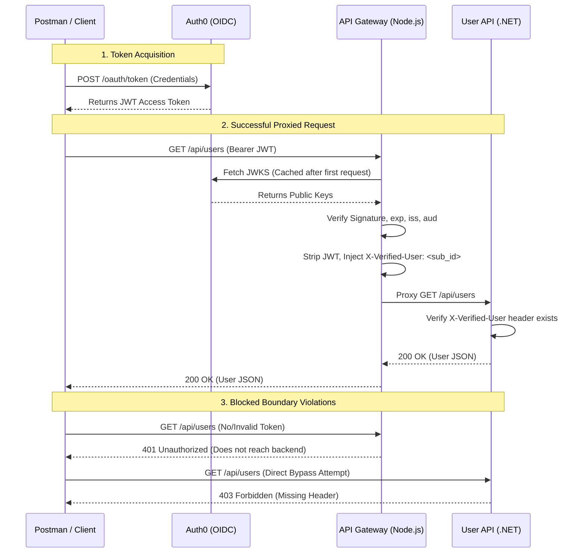

# Secure Entry Gateway PoC: Zero Trust Architecture

This repository contains a proof-of-concept Zero Trust architecture demonstrating strict perimeter defense, identity validation, and microservice isolation. 

## Architectural Decisions

*   **Polyglot Microservices:** The API Gateway is built in **Node.js (TypeScript)** to leverage industry-standard edge-proxy identity middleware (`express-jwt`, `jwks-rsa`). The downstream User API is built as a **.NET Minimal API** to demonstrate high-performance, strongly-typed RESTful service execution.
*   **Separation of Concerns:** Authentication is entirely offloaded to the Gateway. The .NET backend is completely unaware of JWTs, Identity Providers, or cryptographic validation, relying strictly on perimeter network enforcement and injected headers.
*   **JWKS Caching:** The Gateway caches the Identity Provider's public keys locally. It respects the IdP's `Cache-Control` rate limits, ensuring validation latency remains strictly internal without making an outbound HTTP call on every request.
*   **Defense in Depth:** The backend implements a Zero Trust middleware check. Even if a request physically reaches the backend, it will be rejected with a `403 Forbidden` if it lacks the cryptographically injected `X-Verified-User` header.

## Traffic Flow



## Setup Instructions

### 1. Gateway Configuration (.env)
Navigate to the `gateway/` directory and create a `.env` file based on your OIDC provider settings. 

**`.env.example`**
```env
AUTH0_ISSUER=https://YOUR_[TENANT.auth0.com/](https://TENANT.auth0.com/)
AUTH0_AUDIENCE=https://YOUR_API_IDENTIFIER
AUTH0_JWKS_URI=https://YOUR_[TENANT.auth0.com/.well-known/jwks.json](https://TENANT.auth0.com/.well-known/jwks.json)
```

### 2. Running the Services
You will need two terminal instances to run the services concurrently.

**Terminal 1: Start the API Gateway**
```bash
cd gateway
npm install
npm run dev
```
*The Gateway will listen on `http://localhost:3000`*

**Terminal 2: Start the Backend Service**
```bash
cd backend
dotnet run
```
*The Backend will listen on `http://localhost:3001`*

## Testing Scenarios

### 1. Automated Integration Tests
The Gateway includes a Jest test suite that intercepts outbound HTTP calls (mocking the OIDC provider) to prove the perimeter successfully blocks invalid traffic before routing.

```bash
cd gateway
npm test
```

### 2. Manual Success Flow (Postman/cURL)
To execute a successful end-to-end request, retrieve a valid token from your IdP and submit it to the Gateway:

```bash
curl --request GET \
  --url http://localhost:3000/api/users \
  --header 'Authorization: Bearer <YOUR_VALID_JWT>'
```
**Expected Result:** `200 OK` with the user array. The Gateway terminal will output a structured JSON log containing the User ID.

### 3. Manual Failure Scenarios
Prove the Zero Trust boundaries by simulating attacks:

*   **Bypass the Gateway:** Send a request directly to the backend without the proxy header.
    ```bash
    curl --request GET --url http://localhost:3001/api/users
    ```
    **Expected Result:** `403 Forbidden`. The backend rejects the direct connection.
    
*   **Unauthenticated Gateway Access:** Send a request to the Gateway without a token.
    ```bash
    curl --request GET --url http://localhost:3000/api/users
    ```
    **Expected Result:** `401 Unauthorized`. The Gateway blocks the request.